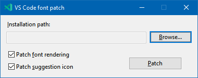
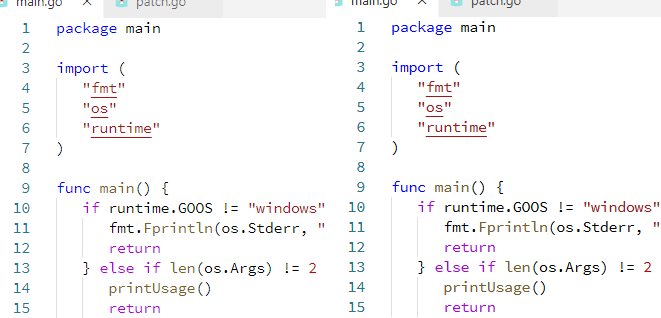

# VSCode Font Patch

A command line utility to patch a Visual Studio Code installation on **Windows**, which does two things:

- slightly enhances the font rendering;
- fixes the autocomplete icon color ([ref](https://stackoverflow.com/q/68321114/6923555)).

## Usage

Close VSCode and run the application.

When opening VSCode again, you will see a warning about a corrupted installation. If you don't ignore it, the changes made by the patch will be reverted.

To revert the patch, simply run VS Code installer again.

## Font comparison before/after patch

* Using Consolas font (original vs. patched)

* Using Source Code Pro font (original vs. patched)

## Dependencies

This project is written in C++20 and uses [WinDlg](https://github.com/rodrigocfd/windlg) library, assuming it's in a parallel directory.

## License

Licensed under [MIT license](https://opensource.org/licenses/MIT), see [LICENSE.md](LICENSE.md) for details.
